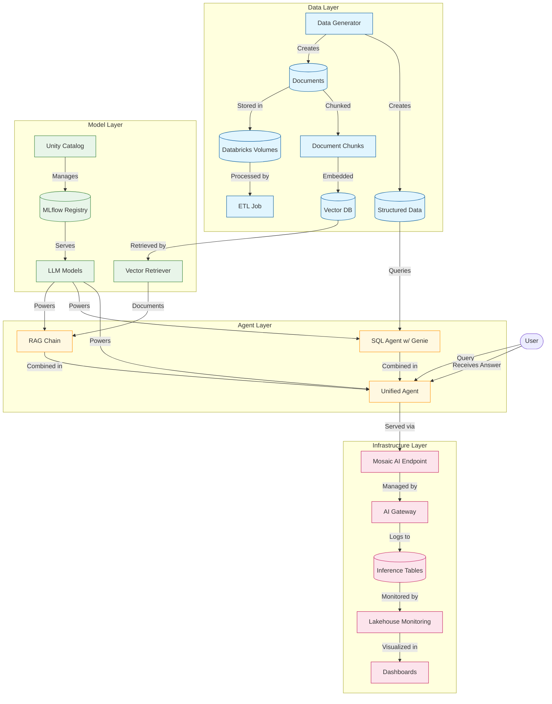

# Databricks RAG Pipeline

A comprehensive, production-ready Retrieval Augmented Generation (RAG) pipeline implementation using Databricks and LangChain.

## 📋 Overview

This project implements an end-to-end Retrieval Augmented Generation (RAG) system on Databricks, leveraging Mosaic AI, Vector Search, MLflow, and other Databricks features. The pipeline combines document retrieval with SQL querying capabilities to create a powerful AI agent that can answer questions about both unstructured documents and structured data.

Key features:
- Production-ready implementation with proper error handling and logging
- Environment-specific configurations (dev, qa, prod)
- Comprehensive monitoring and observability
- Optimized for both performance and cost
- Modular architecture for easy maintenance and extension

## 🏛️ Architecture

The RAG pipeline consists of the following key components:



1. **Data Layer**: Handles synthetic data generation, storage in volumes, and vector embedding creation.
2. **Model Layer**: Manages model registration, vector search, and LLM serving.
3. **Agent Layer**: Combines RAG and SQL capabilities into a unified agent.
4. **Infrastructure Layer**: Handles endpoints, monitoring, and optimization.

## 🧩 Key Components

### Mosaic AI for Model Serving
- Production endpoints with provisioned throughput
- Scale-to-zero for dev/QA environments
- Automated deployment and configuration

### Vector Search
- Databricks Vector DB integration
- Document chunking and embedding generation
- Efficient similarity search

### MLflow 3.0 with Unity Catalog
- Model registration and versioning
- Unity Catalog integration for governance
- Service principal authentication

### Agent Framework
- Unified agent combining RAG and SQL capabilities
- Dynamic routing to specialized agents based on query type
- Error handling with fallback strategies

### Serverless Components
- Serverless warehouse for SQL queries
- Serverless jobs for ETL pipelines
- Cost-optimized infrastructure

### Monitoring and Observability
- Lakehouse monitoring for GenAI
- Inference tables for tracking
- Comprehensive dashboards
- Performance and usage metrics

### Optimization Strategies
- Environment-specific configurations
- Caching mechanisms
- Latency optimization
- Cost management

## 🚀 Getting Started

### Prerequisites
- Databricks workspace with Mosaic AI enabled
- Unity Catalog configured
- Service principal for production deployments

### Installation

1. Clone this repository to your local machine or Databricks workspace:
   ```bash
   git clone https://github.com/yourusername/databricks-rag.git
   ```

2. Upload the code to your Databricks workspace or mount it to your cluster.

3. Install required dependencies:
   ```python
   %pip install langchain langchain-databricks databricks-vectorsearch
   ```

### Configuration

Edit `config/config.py` to update configuration parameters for your environment:

```python
# Update the base configuration with your specific settings
self.base_config = {
    "service_principal": {
        "client_id": os.environ.get("SP_CLIENT_ID", "YOUR_SP_CLIENT_ID"),
        "client_secret": os.environ.get("SP_CLIENT_SECRET", "YOUR_SP_CLIENT_SECRET"),
        "tenant_id": os.environ.get("SP_TENANT_ID", "YOUR_SP_TENANT_ID")
    },
    "uc_config": {
        "catalog_name": "your_catalog_name",
        "schema_name": "your_schema_name",
        # ...other config settings
    }
    # ...rest of the configuration
}
```

## 📝 Usage

### From Python Script

```python
from main import RAGPipeline

# Initialize and run the pipeline in the desired environment
pipeline = RAGPipeline(environment="dev")  # or "qa", "prod"
pipeline.run()

# Ask questions to the RAG agent
response = pipeline.ask("What information do we have about Machine Learning?")
print(response["response"])

# Ask questions about structured data
response = pipeline.ask("How many customers do we have in each region?")
print(response["response"])
```

### From Notebook

Import the notebook `notebook.ipynb` into your Databricks workspace and run the cells to:
1. Set up the RAG pipeline
2. Generate synthetic data
3. Create embeddings and vector index
4. Deploy the model and endpoint
5. Test the agent with various queries

## 📂 Project Structure

```
databricks_rag/
├── config/
│   ├── __init__.py
│   └── config.py            # Configuration parameters
├── data/
│   ├── __init__.py
│   ├── data_generator.py    # Synthetic data generation
│   ├── data_loader.py       # Data loading utilities
│   └── data_storage.py      # Volume and table management
├── models/
│   ├── __init__.py
│   ├── embeddings.py        # Embedding model functionality
│   ├── llm.py               # LLM model utilities
│   └── model_registry.py    # MLflow model registration
├── endpoints/
│   ├── __init__.py
│   ├── mosaic_endpoint.py   # Mosaic AI endpoint creation
│   └── ai_gateway.py        # AI Gateway configuration
├── rag/
│   ├── __init__.py
│   ├── vector_store.py      # Vector store setup
│   ├── rag_chain.py         # RAG chain implementation
│   └── sql_agent.py         # SQL agent with text-to-SQL
├── agents/
│   ├── __init__.py
│   └── unified_agent.py     # Unified agent framework
├── monitoring/
│   ├── __init__.py
│   ├── inference_logger.py  # Inference logging
│   ├── dashboard.py         # Dashboard creation
│   └── lakehouse_monitor.py # Lakehouse monitoring
├── jobs/
│   ├── __init__.py
│   └── etl_job.py           # ETL job definition
├── utils/
│   ├── __init__.py
│   ├── error_handling.py    # Error handling utilities
│   └── optimization.py      # Cost and latency optimization
├── main.py                  # Main entry point
└── notebook.ipynb           # Example notebook
```

## 🔧 Development and Deployment

### Development Workflow
1. Develop and test locally or in a dev Databricks workspace
2. Use the "dev" environment configuration with scale-to-zero
3. Test with small synthetic datasets

### QA Workflow
1. Deploy to QA environment with larger datasets
2. Run integration tests and performance benchmarks
3. Use the "qa" environment configuration

### Production Deployment
1. Register production models in Unity Catalog
2. Deploy endpoints with provisioned throughput
3. Set up monitoring and alerts
4. Use the "prod" environment with service principal authentication

## 📊 Monitoring and Maintenance

### Key Metrics to Monitor
- Latency (average, p95, p99)
- Token usage (input and output)
- Request volume
- Error rates
- Cache hit rates
- Retrieval quality

### Dashboard Overview
The provided dashboards give visibility into:
- Real-time agent performance
- Usage patterns
- Cost metrics
- Error analysis
- Document retrieval metrics

### Optimization Tips
- Adjust vector search parameters for retrieval quality vs. speed
- Tune embedding chunk size for your specific use case
- Use caching in dev/qa environments but consider freshness in production
- Monitor token usage to optimize costs

## 🤝 Contributing

Contributions are welcome! Please feel free to submit a Pull Request.

1. Fork the repository
2. Create your feature branch (`git checkout -b feature/amazing-feature`)
3. Commit your changes (`git commit -m 'Add some amazing feature'`)
4. Push to the branch (`git push origin feature/amazing-feature`)
5. Open a Pull Request


