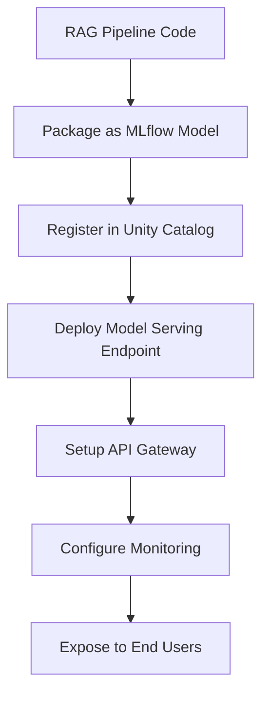

# Serving the RAG Pipeline in Databricks

This guide provides detailed instructions on how to deploy and serve the RAG Pipeline in Databricks environments.

## Deployment Options

There are several ways to deploy and serve the RAG pipeline in Databricks:

1. **Model Serving Endpoint**: Deploy as an MLflow model with a REST API
2. **Databricks Jobs**: Schedule regular updates and deployments
3. **Databricks Dashboard**: Create interactive dashboards for business users
4. **Databricks SQL**: Expose the RAG pipeline via SQL queries
5. **Databricks Connect**: Access the RAG pipeline from external applications

## Deployment Process Overview



## Option 1: Model Serving Endpoint (Recommended)

This approach packages the RAG pipeline as an MLflow model and deploys it as a REST API endpoint.

### Steps:

1. **Prepare the RAG Pipeline**:
   - Ensure all dependencies are available in the serving environment
   - Test the pipeline functionality thoroughly

2. **Package as MLflow Model**:
   ```python
   import mlflow
   
   # Create a wrapper class
   class RagPipelineWrapper(mlflow.pyfunc.PythonModel):
       def __init__(self, pipeline):
           self.pipeline = pipeline
           
       def load_context(self, context):
           pass
           
       def predict(self, context, model_input):
           results = []
           for _, row in model_input.iterrows():
               query = row.get('query', '')
               session_id = row.get('session_id', None)
               response = self.pipeline.ask(query, session_id)
               results.append(response)
           return results
   
   # Log the model to MLflow
   mlflow.pyfunc.log_model(
       python_model=RagPipelineWrapper(pipeline),
       artifact_path="rag_model",
       registered_model_name="rag_pipeline",
       conda_env=mlflow.pyfunc.get_default_conda_env()
   )
   ```

3. **Deploy as a Serving Endpoint**:
   - Navigate to the Models page in Databricks
   - Find your registered model
   - Click "Serve" to create a new endpoint or update an existing one
   - Configure scaling options:
     - For Production: Disable scale-to-zero, set appropriate provisioned throughput
     - For Dev/QA: Enable scale-to-zero to save costs

4. **Invoke the Endpoint**:
   ```python
   import requests
   import json
   
   # Endpoint URL from Databricks
   url = "https://your-databricks-workspace/serving-endpoints/your-endpoint-name/invocations"
   
   # Request payload
   data = {"dataframe_records": [
       {"query": "Your question here", "session_id": "unique-session-id"}
   ]}
   
   # Send request
   response = requests.post(
       url,
       headers={"Authorization": f"Bearer {your_token}"},
       json=data
   )
   
   # Process response
   result = response.json()
   ```

## Option 2: Databricks Jobs

For scheduled deployments, updates, or batch processing:

1. **Create a Deployment Notebook**:
   - Use the provided `serving_rag_pipeline.py` notebook
   - Set up environment variables and configurations

2. **Create a Databricks Job**:
   - Navigate to Workflows > Jobs in Databricks
   - Create a new job using the deployment notebook
   - Configure schedule and cluster settings
   - Set up notifications for success/failure

3. **Run On-Demand or Scheduled**:
   - Run the job manually for immediate deployment
   - Set a schedule for automatic updates (e.g., weekly)

## Option 3: Integration with Databricks SQL

Expose the RAG pipeline to SQL users:

1. **Create SQL Functions**:
   ```sql
   CREATE FUNCTION ask_rag(query STRING, session_id STRING)
   RETURNS STRING
   LANGUAGE PYTHON
   RUNTIME PYTHON_3
   HANDLER handler
   AS $$
   import sys, os
   sys.path.append('/dbfs/FileStore/rag_pipeline')
   from main import RAGPipeline
   import json
   
   def handler(query, session_id=None):
       # Initialize pipeline
       pipeline = RAGPipeline("dev")
       pipeline.run()
       
       # Process query
       response = pipeline.ask(query, session_id)
       
       # Return as JSON string
       return json.dumps(response)
   $$;
   ```

2. **Query from SQL**:
   ```sql
   SELECT ask_rag('What information do we have about Machine Learning?', 'session-123') AS response;
   ```

## Option 4: Databricks Connect

For integrating with external applications:

1. **Set up Databricks Connect**:
   ```bash
   pip install databricks-connect==13.3.0
   databricks-connect configure
   ```

2. **Create a Python Client**:
   ```python
   from databricks.connect import DatabricksSession
   from pyspark.sql.functions import col, lit
   import json
   
   # Initialize session
   spark = DatabricksSession.builder.getOrCreate()
   
   # Call the RAG pipeline
   def query_rag(question, session_id=None):
       result = spark.sql(f"""
           SELECT ask_rag('{question}', '{session_id or ""}') as response
       """).collect()[0]["response"]
       return json.loads(result)
   
   # Example usage
   response = query_rag("What information do we have about Machine Learning?")
   print(response["response"])
   ```

## Production Considerations

### Scaling

- **Scale-to-Zero**: Suitable for dev/QA environments to save costs
- **Provisioned Throughput**: For production to ensure consistent performance
- **Auto-scaling**: Configure min/max workers based on expected traffic

### Authentication & Authorization

- Use service principals for automated deployments
- Set up token-based authentication for API access
- Configure table ACLs in Unity Catalog

### Monitoring & Observability

- Set up dashboard to monitor:
  - Request volume and latency
  - Error rates
  - Token usage
  - Model performance metrics
  
- Configure alerts for:
  - High error rates
  - Unusual latency spikes
  - Guardrails interventions

### CI/CD Integration

1. **Create CI/CD pipeline**:
   - Test the RAG pipeline
   - Package the model
   - Deploy to dev/QA environments
   - Run validation tests
   - Promote to production

2. **Example GitHub Actions workflow**:
   ```yaml
   name: Deploy RAG Pipeline
   on:
     push:
       branches: [main]
   
   jobs:
     deploy:
       runs-on: ubuntu-latest
       steps:
         - uses: actions/checkout@v3
         - name: Set up Python
           uses: actions/setup-python@v4
           with:
             python-version: '3.10'
         - name: Install databricks-cli
           run: pip install databricks-cli
         - name: Configure Databricks CLI
           run: |
             echo "DATABRICKS_HOST=${{ secrets.DATABRICKS_HOST }}" >> $GITHUB_ENV
             echo "DATABRICKS_TOKEN=${{ secrets.DATABRICKS_TOKEN }}" >> $GITHUB_ENV
         - name: Deploy to Databricks
           run: |
             databricks workspace import_dir --overwrite . /Shared/rag_pipeline
             databricks jobs run-now --job-id ${{ secrets.DEPLOYMENT_JOB_ID }}
   ```

## Troubleshooting

### Common Issues

1. **Dependency Management**:
   - Ensure all required libraries are available in the serving environment
   - Package dependencies with the model or use init scripts

2. **Memory Issues**:
   - Increase the instance size for memory-intensive operations
   - Implement pagination for large document retrieval

3. **Cold Start Latency**:
   - Pre-warm the endpoint for critical applications
   - Use provisioned throughput for production environments

4. **Session Management**:
   - Use an external Redis or database for session storage in multi-instance deployments
   - Implement session cleanup to prevent memory leaks

## Resources

- [Databricks Model Serving Documentation](https://docs.databricks.com/machine-learning/model-serving/index.html)
- [Databricks MLflow Documentation](https://docs.databricks.com/mlflow/index.html)
- [Databricks Unity Catalog Documentation](https://docs.databricks.com/data-governance/unity-catalog/index.html)
